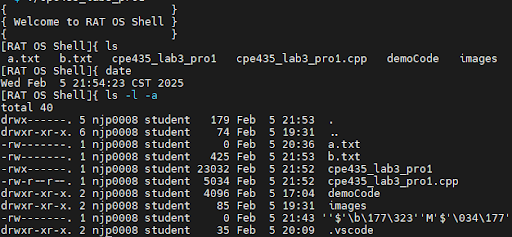

# Redhat-Linux-Kernal-Shell-Project
**Goal:** 
- design custom Red Hat Linux shell capable of executing user commands
  
**Concepts Used:** 
- Forking
- Data Pipes
- Process Control/Communication
  
**Functionality:**
- Capable of executing user commands, handling input/output redirection, and processing single-pipe commands.Made to manage terminal commands using the “|” operator.

  
**External Packages:**
- "unistd" Library (standard x86 C++ operating system library)

## Images

Ex.1 - Terminal Screen
